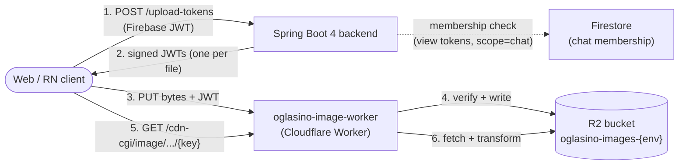

# Image Pipeline

*Token-based upload + signed-URL view flow for product photos, profile pictures, brand assets, and chat attachments. Backend signs JWTs; Cloudflare R2 stores bytes; a Cloudflare Worker (oglasino-image-worker) verifies tokens at the edge.*

**Status:** `web-stable`
**Repos:** `oglasino-backend`, `oglasino-web`, `oglasino-image-worker` (Cloudflare Worker)

---

## Architecture overview

The backend never proxies image bytes. It signs short-lived HS256 JWTs that the Worker verifies; clients upload directly to R2 via the Worker and read back through Cloudflare's image-resizing variants.



| Component | Responsibility | NOT responsible for |
|---|---|---|
| **Backend** | Verify Firebase auth, verify chat membership, sign JWTs, return tokens to clients, manage entity image fields, handle deletion via R2 SDK | Image bytes, image processing, transformation, watermarking |
| **Worker** | Verify JWTs on PUT/GET, validate uploads (size, type, path), stream bytes to/from R2, emit logs | Token issuance, user identity, chat membership, image transformation |
| **Cloudflare Image Resizing** | Generate variants (resize, format conversion, watermark draw) on `/cdn-cgi/image/...` paths | Storage, auth, original byte serving |
| **R2** | Store image bytes | Anything else |
| **Frontend (web)** | UI, browser-side processing (resize, compress, format), URL construction with variants, view token caching | JWT signing, R2 access |

The shared secret (`JWT_SIGNING_SECRET`) is the only coupling between backend and Worker.

---

## Authentication model

### Two distinct secrets

| Concern | Auth mechanism | Secret | Verified by |
|---|---|---|---|
| **Backend → Worker** (admin operations) | Static shared secret in `X-Backend-Auth` header | `BACKEND_SHARED_SECRET` | Worker constant-time compare |
| **Client → Worker** (PUT/GET) | JWT HS256 | `JWT_SIGNING_SECRET` | Worker JWT verify |

The two secrets MUST be different values. Compromise of either does not compromise the other.

### JWT HS256 for client → Worker

Backend signs, Worker verifies. Algorithm: HS256.

Token rotation strategy: **dual-key window**. Worker has two env vars: `JWT_SIGNING_SECRET` and optional `JWT_SIGNING_SECRET_PREVIOUS`. On verify: try current secret first, fall back to previous if present and current fails. Backend signs with current secret only.

### Firebase JWT only used between client and backend

The Worker has zero knowledge of Firebase. Firebase ID tokens are verified at the backend (existing `FirebaseAuthFilter`) and never forwarded to the Worker.

---

## Upload flow

```
1. Client requests upload tokens from backend (Firebase JWT)
2. Backend verifies user, signs N JWTs (one per file), returns array
3. Client (browser-side): processes each file (resize, compress, HEIC→JPEG)
4. Client PUTs each file directly to Worker with its JWT
5. Worker verifies JWT, validates size/type/path, writes to R2, returns key
6. Client sends keys to backend for entity association (create product, etc.)
```

## Display flow

For **public images** (products, profiles):

```
1. Client constructs URL: https://cdn.oglasino.com/cdn-cgi/image/{variant}/{key}
2. Cloudflare Image Resizing fetches original from Worker
3. Worker serves R2 bytes (no auth check — key is in public/ allowlist)
4. Image Resizing transforms (resize, watermark, format) and serves
5. Cloudflare edge caches transformed result
```

For **private images** (chat attachments):

```
1. Client requests view token from backend (Firebase JWT + chatId)
2. Backend verifies chat membership via Firestore, signs view JWT, returns
3. Client constructs URL: https://cdn.oglasino.com/{key}?token={JWT}
4. Worker verifies JWT, validates chatId binding, serves R2 bytes
5. NO Image Resizing for private images (v1) — original size only
```

**View-token caching:** the per-`chatId` view-token Zustand store is implemented on **both** platforms — web `src/lib/stores/viewTokens.ts` and mobile `src/lib/stores/viewTokens.ts`: per-`chatId` cache, 60s pre-expiry buffer, in-flight dedupe, `invalidate(chatId)`, and `clear()` at logout.

---

## Backend endpoints

Three endpoints under `/api/secure/images`. All require an authenticated Firebase user.

### `POST /api/secure/images/upload-tokens`

Issues N upload JWTs (one per content type).

**Request:**

```json
{
  "scope": "product",
  "count": 2,
  "contentTypes": ["image/jpeg", "image/jpeg"],
  "chatId": null
}
```

| Field | Type | Notes |
|---|---|---|
| `scope` | string | `product` \| `profile` \| `chat` \| `review` \| `report` (`review` is a live scope on both web and mobile — reviews upload via the `product` prefix family; `report` reserved v2) |
| `count` | int | 1..5 (binding cap, enforced by `@Max(5)`) |
| `contentTypes` | string[] | length must equal `count`; each must be in the allowlist |
| `chatId` | string | required iff `scope=chat`; rejected otherwise |

**Response 200:**

```json
{
  "tokens": [
    {
      "token": "eyJhbGciOi...",
      "key": "public/products/abc-uuid.jpg",
      "uploadUrl": "https://cdn-stage.oglasino.com/public/products/abc-uuid.jpg",
      "expiresAt": "2026-05-07T18:30:00Z"
    }
  ]
}
```

The client `PUT`s bytes directly to `uploadUrl` with header `x-upload-token: {token}`.

### `POST /api/secure/images/view-tokens`

Issues a single view JWT bound to a path prefix. Only `scope=chat` is supported in v1.

**Request:**

```json
{ "scope": "chat", "chatId": "abc-123" }
```

**Response 200:**

```json
{
  "token": "eyJhbGciOi...",
  "expiresAt": "2026-05-07T22:30:00Z",
  "scope": "chat",
  "chatId": "abc-123"
}
```

Membership is verified via Firestore before signing — non-members get `403 NOT_CHAT_MEMBER`.

### `DELETE /api/secure/images/{*key}`

Client-initiated orphan cleanup. Spring's `{*key}` catch-all pattern allows multi-segment R2 keys with raw `/` characters.

**Validation chain (security-critical, order pinned by tests):**

1. **Auth** — `FirebaseAuthFilter` upstream
2. **Format** — key must start with one of the four allowed prefixes; no traversal (`..`); no leading/trailing `/`
3. **Rate limit** — 1 token against `IMAGE_TOKEN_ISSUANCE`
4. **Ownership** — Redis `upload:owner:{key}` must match caller's userId (TTL = 1h)
5. **In-use** — refuse if any Product / User profile / Review references the key
6. **Age** — R2 object's `lastModified` must be within 1h
7. **Delete** — `r2Service.delete(key)` then `redis.del(upload:owner:{key})`

On success: **204 No Content**.

### Retired endpoints

`POST /api/secure/direct-upload`, `/direct-upload-batch`, and `/view-token` were removed in this feature. Pre-production cutover, no transition period.

### Admin operations

Backend → Worker admin operations route through R2 SDK directly (not the Worker). Single delete (`R2Service.delete`), bulk delete (`R2Service.deleteBulk`), and list by prefix all call R2 directly. The Worker has NO admin endpoints in v1.

---

## Worker endpoints

### `PUT /{key}` — Upload

```http
PUT /public/products/abc-uuid.jpg HTTP/1.1
Host: cdn.oglasino.com
x-upload-token: <JWT-HS256>
Content-Type: image/jpeg
Content-Length: 482301

<raw bytes>
```

Body is raw bytes (NOT multipart/form-data).

**Validation order (fail fast):**

1. Path traversal check
2. Header presence: `x-upload-token`, `Content-Type`, `Content-Length`
3. JWT verification (HS256, current then previous secret)
4. JWT not expired, scope === `"upload"`, key matches request path
5. Content-Type matches JWT claim, Content-Length ≤ JWT maxBytes
6. Idempotency check via R2 head request
7. Stream bytes to R2

**Success 200:** `{ "key": "...", "bytes": 482301, "contentType": "image/jpeg" }`

### `GET /{key}` — Display

**For `public/*` keys (no token required):** path traversal check → R2 get → stream bytes with `Cache-Control: public, max-age=31536000, immutable`.

**For `private/*` keys (token required):** path traversal check → JWT verification → scope/keyPrefix validation → R2 get → stream bytes with `Cache-Control: private, max-age=300`.

**Path-prefix routing:** `/public/*` → public flow, `/private/*` → private flow, `/cdn-cgi/image/*` → Cloudflare Image Resizing edge.

### `HEAD /{key}` — same auth as GET, returns headers only.

### `OPTIONS /*` — CORS preflight.

---

## JWT structure

HS256, signing secret in `JWT_SIGNING_SECRET`. Issuer fixed at `oglasino-backend`.

### Upload token claims

```json
{
  "iss": "oglasino-backend",
  "iat": 1730000000,
  "exp": 1730000600,
  "jti": "01J9X7KZQAF8M2NBAR3M0X5VHE",
  "sub": "<firebase-uid>",
  "scope": "upload",
  "kind": "product",
  "key": "public/products/abc-uuid.jpg",
  "contentType": "image/jpeg",
  "maxBytes": 10485760
}
```

One token = one file. Worker enforces: key matches exactly, Content-Type matches, Content-Length ≤ maxBytes. TTL: 10 minutes.

### View token claims

```json
{
  "iss": "oglasino-backend",
  "iat": 1730000000,
  "exp": 1730014400,
  "jti": "01J9X7L4M2C9N0Q5T8V1W2H3K4",
  "sub": "<firebase-uid>",
  "scope": "view",
  "kind": "chat",
  "keyPrefix": "private/chats/abc-123/",
  "chatId": "abc-123"
}
```

Worker enforces `requestedKey.startsWith(keyPrefix)`. Cross-chat token replay returns `403 TOKEN_KEY_MISMATCH`. TTL: 4 hours. Frontend caches per `chatId` (Zustand store).

### What's NOT in the claims

No `aud` (single audience), no `nbf` (valid immediately), no raw email/display name (PII minimization), no `roles`/`permissions` (Worker doesn't make authorization decisions).

---

## R2 bucket organization

Single source of truth in `ImagePaths.java` — do not hardcode the prefixes anywhere else.

```
oglasino-images-{env}/
├── public/
│   ├── products/{uuid}.{ext}
│   ├── profiles/{uuid}.{ext}
│   └── brand/{filename}
└── private/
    ├── chats/{chatId}/{uuid}.{ext}
    └── reports/                     ← v2, deferred
```

| Prefix | Use | Visibility | Cache | Watermark |
|---|---|---|---|---|
| `public/products/` | Product listing photos | public | 1y | Yes (hero variant) |
| `public/profiles/` | User profile pictures | public | 1y | No |
| `public/brand/` | Brand assets (watermark) | public | 1y | No (it IS the watermark) |
| `private/chats/{chatId}/` | Chat attachments | private | 5 min | No |

**Entity field semantics:** `Product.imageKeys`, `User.profileImageKey`, `Review.imageKeys` all store **full keys with prefix** (e.g. `public/products/abc.jpg`). No bare UUIDs.

---

## Error codes

Errors flow as `{"error": {"code": "X", "message": "...", "details": {...}, "retryable": bool}}`. Frontend keys i18n off `error.code`.

### Backend codes

| Code | HTTP | When |
|---|---|---|
| `INVALID_SCOPE` | 400 | scope not in enum |
| `INVALID_COUNT` | 400 | count outside 1..5 |
| `CONTENT_TYPES_MISMATCH` | 400 | array length != count |
| `CONTENT_TYPE_NOT_ALLOWED` | 400 | content type outside allowlist |
| `CHAT_ID_REQUIRED` | 400 | scope=chat without chatId |
| `CHAT_ID_NOT_ALLOWED` | 400 | chatId provided with non-chat scope |
| `INVALID_KEY` | 400 | DELETE: malformed key |
| `UNAUTHENTICATED` | 401 | Firebase JWT missing/invalid |
| `NOT_CHAT_MEMBER` | 403 | Firestore says user not in chat |
| `NOT_OWNER` | 403 | DELETE: no Redis ownership / UID mismatch |
| `IMAGE_TOO_OLD` | 403 | DELETE: object older than 1h |
| `IMAGE_NOT_FOUND` | 404 | DELETE: R2 reports NoSuchKey |
| `IMAGE_IN_USE` | 409 | DELETE: referenced by entity |
| `RATE_LIMITED` | 429 | bucket exhausted |
| `INTERNAL` | 500 | JJWT signing failure or Firestore IO |

### Worker codes

| Code | HTTP | When |
|---|---|---|
| `TOKEN_MISSING` | 400 | No token on PUT/private GET |
| `TOKEN_MALFORMED` | 400 | Token doesn't parse as JWT |
| `TOKEN_EXPIRED` | 401 | JWT expired |
| `TOKEN_SIGNATURE_INVALID` | 401 | HMAC verification failed |
| `TOKEN_ISSUER_INVALID` | 401 | iss ≠ `"oglasino-backend"` |
| `TOKEN_SCOPE_MISMATCH` | 403 | Wrong scope for operation |
| `TOKEN_KEY_MISMATCH` | 403 | Key/prefix doesn't match |
| `CONTENT_TYPE_NOT_ALLOWED` | 415 | Type not in allowlist |
| `CONTENT_TYPE_MISMATCH` | 415 | Type doesn't match JWT claim |
| `FILE_TOO_LARGE` | 413 | Exceeds maxBytes |
| `PATH_TRAVERSAL` | 400 | Forbidden path component |
| `RATE_LIMITED` | 429 | Worker-side rate limit |
| `OBJECT_NOT_FOUND` | 404 | Missing R2 key |
| `R2_WRITE_FAILED` | 500 | R2 write error |
| `R2_READ_FAILED` | 500 | R2 read error |

---

## CORS policy

| Origin | When |
|---|---|
| `https://oglasino.com` | Production |
| `https://www.oglasino.com` | Production www |
| `https://oglasino-web.vercel.app` | Stable Vercel alias |
| `https://oglasino-web-*.vercel.app` | Vercel preview deployments (suffix match) |
| `http://localhost:3000` | Local dev |
| `http://localhost:3001` | Local dev fallback |

Methods: `GET, PUT, POST, OPTIONS, HEAD`. Credentials: `false` (Worker MUST NOT accept cookies). Preflight cache: 86400s. React Native: CORS does not apply (no Origin header).

---

## Rate limiting

### Backend token issuance

Category `IMAGE_TOKEN_ISSUANCE`: **60 tokens/min per user** (Bucket4j-Redis). `/upload-tokens` with `count: N` consumes N tokens; `/view-tokens` consumes 1. Enforced after validation — failed requests do NOT burn budget.

### Worker-side

Per `tokenJti`: ~5 PUT attempts max (stops leaked token abuse). Per source IP: ~100 PUTs/sec, ~1000 GETs/sec. Public images edge-cached so Worker rarely hit.

---

## Browser-side image processing pipeline

Per uploaded file, in order:

1. **Validate type:** `image/jpeg`, `image/png`, `image/webp`, `image/heic`, `image/heif` only
2. **Validate file size:** max 10 MB raw input
3. **Validate dimensions:** max 8000×8000px raw input
4. **HEIC/HEIF conversion:** if HEIC, convert to JPEG (lazy-loaded `heic2any`)
5. **Resize:** if longest side > 2400px, resize to 2400px maintaining aspect ratio
6. **Format normalization:** PNG without transparency → JPEG q85; PNG with transparency → keep PNG; JPEG → re-encode q85; WebP → keep WebP
7. **Final size check:** max 5 MB after processing. If still larger, reduce quality to 75 and retry.
8. **Upload processed file** with `Content-Type` reflecting final format

Libraries: `browser-image-compression` (canvas-based resize), `heic2any` (HEIC → JPEG, dynamic import).

Worker defense-in-depth: rejects Content-Type not in allowlist, Content-Length > 10 MB, Content-Type ≠ JWT claim, Content-Length > JWT maxBytes. No magic-byte sniffing in v1.

---

## Cloudflare Image Resizing variants

| Variant | Width | Height | Fit | Format | Quality | Watermark |
|---|---|---|---|---|---|---|
| `card` | 400 | 300 | cover | auto | 85 | No |
| `hero` | 1600 | 1200 | scale-down | auto | 85 | Yes |

Hero watermark via `draw` parameter pointing at `public/brand/logo-watermark.png`. Until logo is uploaded, hero renders without watermark (silent fallback). Frontend feature-flags `draw` inclusion via `NEXT_PUBLIC_WATERMARK_ENABLED`.

Beyond `card`/`hero`, an `original` passthrough variant — `${CDN_BASE}/{key}`, no resizing — exists in both web and mobile `variants.ts` (used for un-resized assets such as flag icons on web).

Frontend URL helper at `src/lib/images/variants.ts`:

- `publicImageUrl(key, variant)` → `${CDN_BASE}/cdn-cgi/image/${params}/${key}`
- `privateImageUrl(key, viewToken)` → `${CDN_BASE}/${key}?token=${viewToken}`

---

## Orphan cleanup

### Layer 1 — Client-initiated DELETE (fast path)

`DELETE /api/secure/images/{key}` prunes within seconds of upload. Depends on Redis ownership record: `upload:owner:{full-key} → userId (TTL = 1h)`, recorded at upload-token issuance time.

### Layer 2 — Scheduled sweeper (backstop)

`ProductImagesRemovalJob` runs daily at 03:00 UTC, sweeps `public/products/` and `public/profiles/`, 24-hour grace period. Per-key and per-prefix error isolation. Memory-bounded: streaming pages of ≤1000 keys.

Defense in depth. DELETE covers ~99% of orphans within seconds; sweeper guarantees the rest within 24h.

---

## Scheduled jobs

| Job | Schedule | Sweeps | Memory profile |
|---|---|---|---|
| `ChatImagesRemovalJob` | Sundays 03:00 | `private/chats/`, objects ≥30 days old | Buffers up to 1000 keys, flushes via bulk-delete |
| `ProductImagesRemovalJob` | Daily 03:00 UTC | `public/products/` + `public/profiles/` orphans | Per-key existence check, no buffering |

Both use `R2Service.streamImagesOlderThan(prefix, cutoff, consumer)` for paginated R2 listing (≤1000 keys per page in memory). Sweeper disabled by default in `dev`, enabled in `prod` via `IMAGE_SWEEPER_ENABLED`.

---

## Logging and observability

Worker logs to Cloudflare Logs (Workers Trace Events) as structured JSON. Backend logs to existing SLF4J pipeline.

`x-request-id` propagated end-to-end: Worker generates UUID v4 on every request, echoes in every response and log line. Backend captures Worker's `x-request-id` when calling Worker.

Worker log levels: INFO for successful uploads and private GETs, WARN for signature/scope/key mismatches and path traversal, ERROR for R2 failures. Successful public GETs not logged (too noisy).

---

## Configuration

### Backend (`application.yaml`)

```yaml
app:
  images:
    cdn-base-url: ${CDN_BASE_URL:https://cdn.oglasino.com}
    upload-token-ttl-ms: ${UPLOAD_TOKEN_TTL_MS:600000}
    view-token-ttl-ms: ${VIEW_TOKEN_TTL_MS:14400000}
    max-upload-bytes: ${MAX_UPLOAD_BYTES:10485760}
    max-images-per-request: ${MAX_IMAGES_PER_REQUEST:5}
    allowed-content-types: ${ALLOWED_CONTENT_TYPES:image/jpeg,image/png,image/webp,image/heic,image/heif}
    jwt:
      signing-secret: ${JWT_SIGNING_SECRET}
      issuer: oglasino-backend
```

The app **refuses to start** if `JWT_SIGNING_SECRET` is missing or shorter than 32 bytes.

### Worker (`wrangler.toml`)

| Variable | Type | Purpose |
|---|---|---|
| `JWT_SIGNING_SECRET` | secret | HS256 secret for JWT verify |
| `JWT_SIGNING_SECRET_PREVIOUS` | secret | Optional: previous secret during rotation |
| `BACKEND_SHARED_SECRET` | secret | For `X-Backend-Auth` (unused in v1) |
| `ALLOWED_ORIGINS` | var | CORS allowlist |
| `ALLOWED_CONTENT_TYPES` | var | Upload type allowlist |
| `MAX_UPLOAD_BYTES` | var | 10 MB hard cap |
| `ENVIRONMENT` | var | `production` / `staging` / `development` |
| `BUCKET` | binding | R2 binding name |

### Frontend

`NEXT_PUBLIC_CDN_URL` (points at Worker domain), `NEXT_PUBLIC_WATERMARK_ENABLED` (default `false`).

---

## Worker repo and deployment

Repository: `oglasino-worker` (under `memento-tech` GitHub org). Separate repo because Workers have an independent deployment lifecycle.

Two routes: production at `cdn.oglasino.com/*`, staging at `cdn-stage.oglasino.com/*`. Deployment via `wrangler deploy`. CI: GitHub Actions, staging on push to `dev`, production on push to `main`.

---

## Translation keys

### Seeded (68 rows)

All 17 keys ARE seeded ×4 languages (EN/RS/RU/CNR) — **68 rows confirmed** in the backend audit §10. These are not pending; the earlier "pending registration / `TODO(phase 7)`" framing is stale. The seeded key names below are **authoritative** — they are the strings that actually resolve. Four active keys carry seeded names that differ from the original spec strings (the old spec strings were never seeded and would silently miss): `converting-heic` → `converting_heic` (underscore), and the `.label` suffixes on `complete`/`uploading` plus the `image.uploading*` → `image.processing.uploading*` rescoping. The `.label` suffixes are Part 6 Rule 2 (parent/child collision) renames.

**Active keys (10 keys) — authoritative seeded names:**

| Key | Namespace | English |
|---|---|---|
| `image.upload.failed` | `ERRORS` | `Image upload failed: {filename} ({code})` |
| `image.processing.validating` | `INPUT` | `Checking…` |
| `image.processing.converting_heic` | `INPUT` | `Converting HEIC…` |
| `image.processing.resizing` | `INPUT` | `Resizing…` |
| `image.processing.encoding` | `INPUT` | `Compressing…` |
| `image.processing.cancelled` | `INPUT` | `Cancelled` |
| `image.processing.error` | `INPUT` | `Failed` |
| `image.processing.complete.label` | `INPUT` | `Done · {originalSize} → {processedSize}` |
| `image.processing.uploading.label` | `INPUT` | `Uploading…` |
| `image.processing.uploading.with.size` | `INPUT` | `Uploading {size}…` |

**Phase 8 reserved keys (7 keys):**

| Key | Namespace | Maps to error codes |
|---|---|---|
| `image.invalid` | `ERRORS` | `TOKEN_MISSING`, `TOKEN_MALFORMED`, `PATH_TRAVERSAL`, validation codes |
| `image.forbidden` | `ERRORS` | `TOKEN_SCOPE_MISMATCH`, `TOKEN_KEY_MISMATCH`, `NOT_CHAT_MEMBER` |
| `image.bad.format` | `ERRORS` | `CONTENT_TYPE_NOT_ALLOWED`, `CONTENT_TYPE_MISMATCH` |
| `image.rate.limited` | `ERRORS` | `RATE_LIMITED` |
| `image.server.error` | `ERRORS` | `R2_WRITE_FAILED`, `R2_READ_FAILED`, `INTERNAL` |
| `image.token.expired` | `ERRORS` | `TOKEN_EXPIRED` (after retry exhaustion) |
| `image.session.expired` | `ERRORS` | `UNAUTHENTICATED` |

**Already registered (do NOT re-register):** `image.max`, `image.too.big`, `image.duplicate`, `image.broke`, `image.not.good`, `images.holder.label`, `images.import`, `button.close.label`, `button.cancel.label`.

All four languages (EN, RS, RU Latin transliteration, CNR) needed per key. RU transliterations are best-effort and need native review.

---

## Retry policy

Implemented on both platforms (not deferred): 5xx with exponential backoff `[1s, 4s]` (2 retries), 429 with `Retry-After` handling, network errors retry once, and 401 on a private GET invalidates the cached view token. One intentional platform difference: on a 429, **web surfaces immediately** while **mobile honors `Retry-After` and retries once** — see [Platform adoption](#platform-adoption) and the [decisions.md](../decisions.md) 2026-05-30 entry.

---

## Deferred items

### `deleteProduct` test coverage

No direct test for `DefaultProductService.deleteProduct` end-to-end. Image cleanup verified at the helper layer.

### Fire-and-forget virtual thread in `deleteProduct`

`Thread.ofVirtual().start(() -> imageService.deleteImagesAndClearOwnership(...))` has a JVM-kill window risk. Sweeper backstops. Options: drop the virtual thread (synchronous), or replace with a durable `pending_image_cleanup` queue.

### Cache invalidation on `updateProduct`

Whether product-detail or product-overview caches are invalidated on update is unverified. Needs a `@Cacheable`/`@CacheEvict` audit for Product reads.

### R2 orphans from failed batch uploads

With fail-fast batch semantics, partial upload batches leave R2 orphans. Sweeper backstops. Pre-production, no scale concern.

---

## Production deploy notes

- **DB reset:** none required. Entity fields already `TEXT` / unrestricted VARCHAR.
- **R2 cleanup:** `oglasino-images-prod` pre-launch reset wipes the bucket.
- **Brand asset upload:** watermark logo uploaded manually post-deploy to `public/brand/logo-watermark.png`. PNG with transparency, ~200×60px.
- **Worker secret rotation:** `JWT_SIGNING_SECRET` must rotate in lockstep. Worker supports `JWT_SIGNING_SECRET_PREVIOUS` for zero-downtime rotation.

---

## Trust boundaries

- Backend verifies Firebase auth and Firestore chat membership before signing any JWT.
- Worker verifies JWT signature, expiry, scope, key binding. Worker has zero knowledge of Firebase.
- Client never accesses R2 directly. All reads/writes go through the Worker.
- `JWT_SIGNING_SECRET` is the only coupling between backend and Worker — provisioned out-of-band (password manager).
- Redis ownership record (`upload:owner:{key}`) provides deletion authorization. TTL-bounded (1h).
- Entity fields store full keys with prefix — no path construction from user input.

---

## Platform adoption

Backend and web are complete. Mobile (`oglasino-expo`) is **implemented and validated** (on `new-expo-dev`); on-device smoke is the remaining gate before `mobile-stable` (see [image-pipeline-mobile-test-cases.md](image-pipeline-mobile-test-cases.md) and the [decisions.md](../decisions.md) 2026-05-30 entry).

As-built mobile implementation:

- **Token-based upload via one shared orchestrator** (`uploadImages`) across all four surfaces — product, profile, chat, and review.
- **Display on `expo-image`.** HEIC→JPEG is handled natively at the picker boundary via `expo-image-manipulator` (web's `heic2any` is browser-only and is not used on mobile).
- **Raw-byte PUT via `expo-file-system` `BINARY_CONTENT`** — not multipart, not fetch+Blob.
- **Same contract as web:** same endpoints, same JWT structure, same full-prefixed-key contract. CORS does not apply on React Native (no Origin header).
- **One intentional platform divergence:** on a 429, mobile honors `Retry-After` and retries once; web surfaces immediately. Deliberate — the better mobile UX (cross-reference the [decisions.md](../decisions.md) 2026-05-30 entry).
- **No new native module** — all image libraries are first-party Expo modules already in the dev build.
- **Progressive per-stage status text in the product upload dialog** — the dialog surfaces per-file stage labels (Checking → Resizing → Compressing → Uploading → Done) sourced from the shared upload-progress store via the `stageLabel` helper (wired in chat H, session `oglasino-expo-image-pipeline-5`; before that the dialog showed only a spinner).
- **Image-source picker sheet strings are translation-keyed** — the three previously-hardcoded Serbian strings in `ImageSourceSheet.tsx` (sheet title + Camera / Gallery buttons) now resolve via `image.source.title` (DIALOG) and `image.source.camera` / `image.source.gallery` (BUTTONS), backend-seeded ×4 locales (B15, mobile swap session `oglasino-expo-imagesourcesheet-liveness-1`; EN + RS final, RU + CNR placeholder, native review owed — see [decisions.md](../decisions.md) 2026-05-31 chat-H entry).
