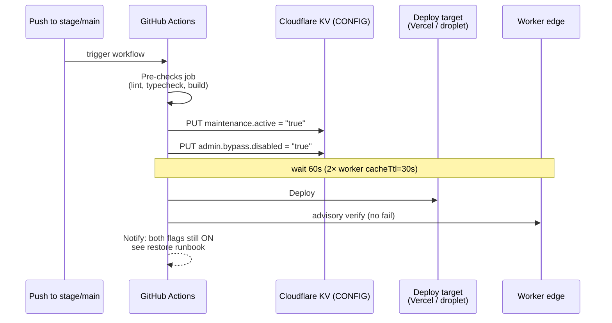

# Maintenance Gate

The Cloudflare router worker (`oglasino-router-prod` and `oglasino-router-stage`) enforces a maintenance gate in front of every request to Oglasino. The gate is driven by KV flags that backend and web deploy workflows set at deploy time. Restore is manual, via three steps run by an operator after the deploy.

The gate is split into two flags so that a deploy can lock out **all** traffic (operator and end-user alike) until the operator explicitly chooses to let admin traffic in, refresh caches, then let public traffic in. This is the operational standard — there is no auto-off.

For the gate-internal limitations surfaced during the maintenance-split audit, see [Known limitations](#known-limitations) and the linked entries in [`../../issues.md`](../../issues.md).

## KV keys the worker reads

The worker reads three keys from the `CONFIG` KV namespace. All are string-typed; only the literal string `"true"` is truthy. Any other value — absent, `"false"`, empty — is treated as false.

| Key                     | Type   | Truthy value | Effect when truthy                                                       |
| ----------------------- | ------ | ------------ | ------------------------------------------------------------------------ |
| `maintenance.active`    | string | `"true"`     | Engages the maintenance gate.                                            |
| `admin.bypass.disabled` | string | `"true"`     | Disables the admin bypass. Only consulted when `maintenance.active` is on. |
| `use.backend.check`     | string | `"true"`     | Runs the backend liveness probe. On probe failure, forces `maintenance.active = true` for that request. |

**Default behavior when keys are absent.** A missing key reads as `null` and is treated as `"false"`. With no KV entries, all three flags are off and traffic passes through normally. Backend and web read-back agree on this — the default is open.

The worker caches each KV read for 30 seconds (`{cacheTtl: 30}`). The 60-second deploy-time wait (see [Deploy flow](#deploy-flow)) is 2× this, to cover propagation across all edges.

## Gate behavior matrix

The two primary flags compose into four cells. The worker's behavior in each:

| `maintenance.active`  | `admin.bypass.disabled` | Effect                                                                                 |
| --------------------- | ----------------------- | -------------------------------------------------------------------------------------- |
| `false` (or absent)   | (any)                   | All traffic passes through to origin.                                                  |
| `true`                | `false` (or absent)     | Admin requests bypass; non-admin requests receive a 503 maintenance response.          |
| `true`                | `true`                  | All traffic blocked, including admin. **Full lockdown.** Deploy-time default.          |

Admin classification (case-insensitive): any path matching `/{xx-xx}/admin[/...]` (2-letter-dash-2-letter locale prefix), `/api/*`, `/_next/*`, `/favicon.ico`, or the API host.

### Closed-response shapes

When the gate engages and admin bypass does not apply:

- **API path** — `HTTP 503`, headers `Content-Type: application/json; charset=utf-8`, `Retry-After: 120`, `Cache-Control: no-store`, `X-Oglasino-Maintenance: true`. Body:

  ```json
  {
    "status": "maintenance",
    "message": "Oglasino is undergoing maintenance. Please try again in a few minutes.",
    "retryAfter": 120
  }
  ```

- **Frontend path** — `HTTP 503`, body proxied from `MAINTENANCE_ORIGIN` (the `oglasino-maintenance` worker — see [`workers.md`](workers.md)), headers include `X-Oglasino-Maintenance: true`, `Cache-Control: no-store`, `Retry-After: 120`.

## use.backend.check

`use.backend.check` is a pre-existing third input to the gate, unchanged by the split. When set to `"true"`, the worker runs a backend liveness probe per request; on probe failure, it forces `maintenance.active = true` for that request only (no KV write — the override is in-memory and request-scoped).

This is a separate input from `maintenance.active` and `admin.bypass.disabled`. A reader treating the matrix above as the complete gate spec will miss it — see [issues.md](../../issues.md) (matrix-comment incomplete).

The `use.backend.check` read currently sits **outside** the fail-open `try`/`catch` that wraps the other two KV reads. A transient KV outage on this specific read propagates as a request failure rather than falling open, contradicting the worker's documented fail-open intent. Trivial fix (wrap or move inside the existing try); tracked as a medium-severity item in [issues.md](../../issues.md).

## Locale prefix and admin bypass — known limitation

Admin classification uses the regex `/^\/[a-z]{2}-[a-z]{2}\/admin(\/|$)/i` — strictly two letters, a dash, two letters. The three web locales `rsmoto-sr`, `rsmoto-en`, `rsmoto-ru` do not match this shape, so an admin URL under one of those locales will not be classified as admin and will not bypass the gate.

This is documented as a known limitation. A fix is out of scope here and belongs with whatever feature next touches locale routing. Logged for future work.

## Deploy flow

Backend (`oglasino-backend`) and web (`oglasino-web`) follow the same six-step pattern. The workflow triggers on push to `stage` (stage environment) or `main` (prod environment).



Step-by-step:

1. **Trigger.** Push to `stage` (stage env) or `main` (prod env) starts the workflow.
2. **Pre-checks.** Lint, typecheck, build. Failure aborts before any KV write.
3. **Flag flip.** Both `maintenance.active` and `admin.bypass.disabled` are set to `"true"` via `curl` against the Cloudflare REST API. Full lockdown engaged.
4. **Propagation wait.** 60 seconds. The worker's per-key `cacheTtl` is 30 seconds; the wait is doubled so that every edge sees both flags `"true"` before any deploy artifact lands.
5. **Deploy.** Vercel CLI for web, droplet-side for backend.
6. **Advisory verify.** The workflow probes the edge to confirm the maintenance response is visible. **Warns only; does not fail the deploy.**
7. **Notify.** Final workflow message states that both flags remain ON, the deploy is complete, and points the operator to the [restore runbook](#restore-runbook).

There is **no auto-off** and **no backend liveness probe** in this flow. The operator restores manually using the three-step runbook below.

## Restore runbook

Run these three steps **in order**, after the deploy workflow finishes. The ordering matters — skipping or reordering breaks the operational contract.

1. **`/opt/oglasino/scripts/admin-bypass-allow.sh`** (on the droplet). Flips `admin.bypass.disabled` to `"false"`. Admin traffic can now reach the panel; end-user traffic is still blocked.
2. **Refresh caches in the admin panel.** Clears caches and warms them while only admin traffic is permitted, so the warm-up does not dump cold-cache load on end users.
3. **`/opt/oglasino/scripts/maintenance-off.sh`** (on the droplet). Flips `maintenance.active` to `"false"`. End-user traffic resumes against a warmed cache.

**Why the order.**

- Step 1 must precede Step 2 — until the admin bypass is allowed, the operator cannot reach the admin panel through the gate to refresh caches.
- Step 2 must precede Step 3 — flipping `maintenance.active` off before the caches are warm dumps cold-cache traffic at users; warming under admin-only load avoids that.

## Droplet scripts

Both scripts live at `/opt/oglasino/scripts/` on the production droplet. Both load Cloudflare credentials from `/opt/oglasino/.env.cf` and write to the same KV namespace as the deploy workflows. Both are `chmod +x` and runnable directly if the running user has shell access and read access to `.env.cf`.

<!-- TODO: confirm with Igor — exact ownership (user:group) for both scripts and for .env.cf -->

| Script                    | What it does                                              | Owner               |
| ------------------------- | --------------------------------------------------------- | ------------------- |
| `admin-bypass-allow.sh`   | Flips `admin.bypass.disabled` to `"false"` via Cloudflare REST API. Echoes a confirmation message on success. | <!-- TODO --> `<user>:<group>` |
| `maintenance-off.sh`      | Flips `maintenance.active` to `"false"` via Cloudflare REST API. Echoes a confirmation message on success. | <!-- TODO --> `<user>:<group>` |

Both scripts use the same credentials (`CF_API_TOKEN`, `CF_ACCOUNT_ID`, namespace ID) sourced from `/opt/oglasino/.env.cf`. The file is the single point of secret rotation for both scripts. See [`../overview/secret-inventory.md`](../overview/secret-inventory.md) for the secret-name conventions used elsewhere; the `.env.cf` file is not currently inventoried as a separate location.

## Known limitations

Surfaced during the 2026-05-15 maintenance-split-propagation audit. None are blockers for the gate's normal operation; all are tracked in [`../../issues.md`](../../issues.md).

- **`use.backend.check` read sits outside the fail-open `try`/`catch`.** A transient KV outage on this specific read propagates as a request failure. Medium-severity, trivial fix.
- **Matrix comment in the worker source omits `use.backend.check`.** The header block in `oglasino-router/src/index.ts` reads like the gate spec but only documents the two split flags — a reader misses a real input. Low-severity, documentation-only fix.
- **Admin locale-prefix regex is hardcoded to `xx-xx`.** Three web locales (`rsmoto-sr`, `rsmoto-en`, `rsmoto-ru`) do not match. Out of scope; lives with whatever feature next touches locale routing.

## References

- [`workers.md`](workers.md) — list of deployed Cloudflare workers, including `oglasino-maintenance` (the origin served as the 503 frontend body)
- [`../overview/secret-inventory.md`](../overview/secret-inventory.md) — Cloudflare secrets used by the deploy workflows and the backend runtime KV writer
- [`../digitalocean/droplets.md`](../digitalocean/droplets.md) — the droplet that hosts the restore scripts
- [`../../issues.md`](../../issues.md) — open issues surfaced by the maintenance-split-propagation audit
- [`../../decisions.md`](../../decisions.md) — the 2026-05-15 decision entry that established this split-flag gate and manual three-step restore
